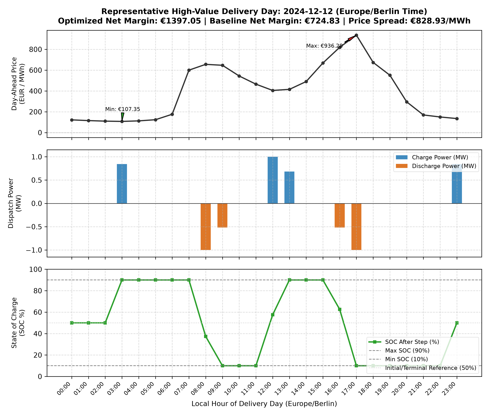
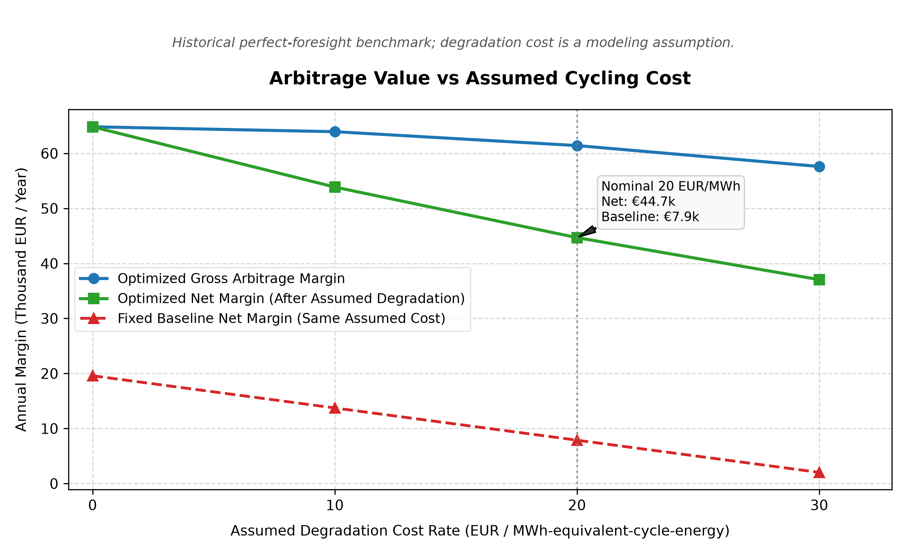
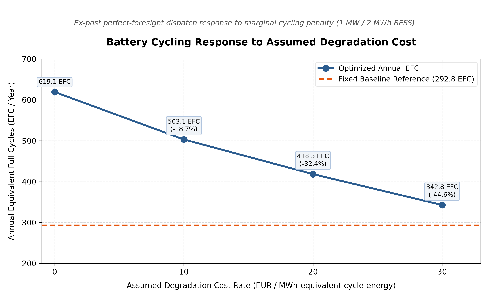
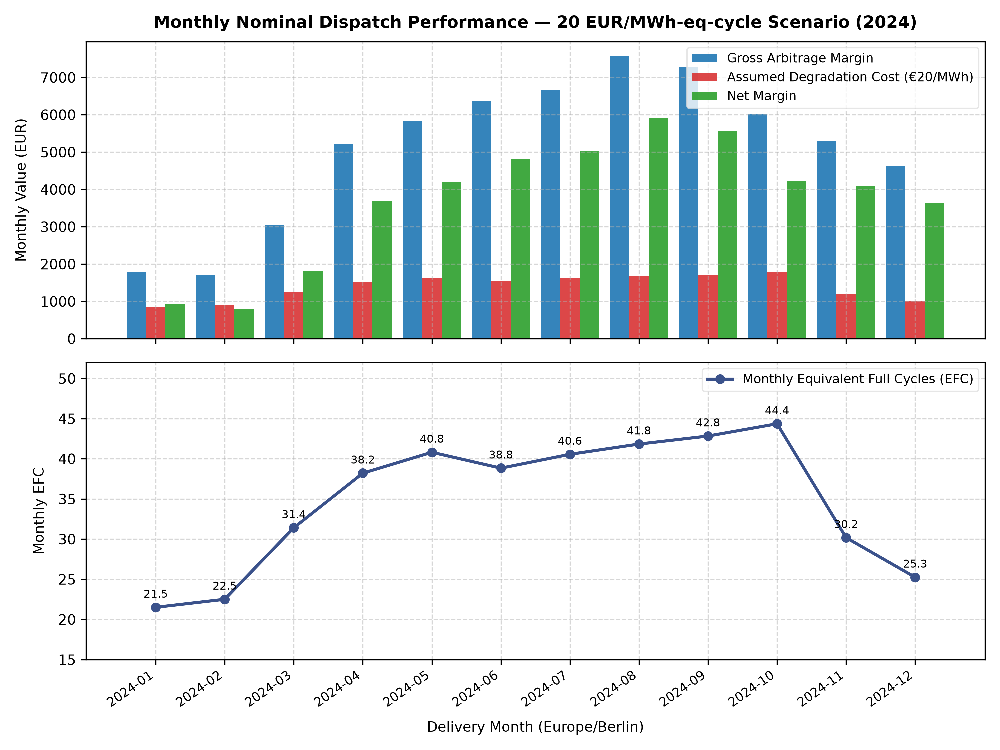
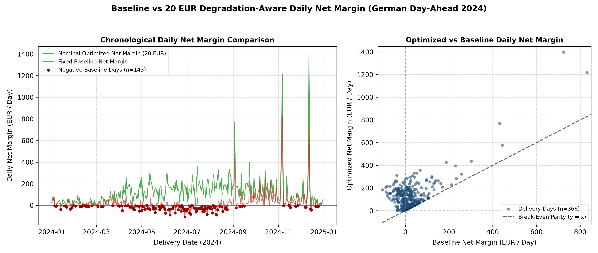

# German BESS Dispatch & Degradation Analytics

> Techno-economic analysis of a 1 MW / 2 MWh battery operating in the German/Luxembourg day-ahead electricity market using validated SMARD data, battery physics, MILP dispatch optimization, and degradation-cost sensitivity analysis.

---

## Project Overview

This project provides an ex-post techno-economic evaluation of a utility-scale Battery Energy Storage System (BESS) operating in the German/Luxembourg day-ahead wholesale electricity market (EPEX Spot / SMARD) across the entire 2024 calendar year.

- **Market Series**: Bundesnetzagentur / SMARD Day-Ahead Spot Electricity Prices (Filter 4169, Region DE/LU).
- **Evaluation Period**: Calendar year 2024 (2024-01-01 00:00 to 2025-01-01 00:00 Europe/Berlin).
- **Time Horizon**: 8,784 continuous hourly intervals across 366 delivery days (leap year).
- **Daylight Saving Time (DST)**: Full compliance with local German market delivery days, safely resolving the 23-hour spring transition (2024-03-31) and the 25-hour autumn transition (2024-10-27).
- **Negative Settlement Prices**: 457 hours settled below 0.00 EUR/MWh (minimum: -135.45 EUR/MWh).
- **Battery System**: 1.0 MW / 2.0 MWh grid-connected lithium-ion battery model.

---

## Key Results

All financial and physical metrics are computed ex-post on realized 2024 market data:

| Metric | Fixed Baseline | Zero-Cost MILP (Step 7) | Nominal 20 EUR Scenario (Step 8) |
|---|---|---|---|
| **Gross Arbitrage Margin** | €19,588.28 | €64,831.06 | €61,417.49 |
| **Assumed Cycling Cost** | €11,712.00 (at €20) | €0.00 | €16,732.05 |
| **Net Margin** | €7,876.28 (at €20) | €64,831.06 | €44,685.44 |
| **Annual Cycling (EFC)** | 292.80 EFC | 619.12 EFC | 418.30 EFC |
| **Gross Arbitrage Value / EFC** | €66.90 / EFC | €104.72 / EFC | €146.83 / EFC |
| **Annual Utilization** | 16.67% (1,464 hrs) | 35.44% (3,113 hrs) | 24.15% (2,121 hrs) |
| **Net Outperformance vs Baseline** | Benchmark | +€45,242.77 (+230.97% gross) | +€36,809.16 (+467.34% net) |

*Note on baseline comparison: The physical baseline schedule itself does not change; only the same assumed economic cycling cost (€20/MWh-equivalent-cycle-energy × 585.60 MWh equivalent-cycle energy = €11,712.00) is applied to calculate baseline net margin (€7,876.28) for fair net-margin comparison against the nominal 20 EUR optimized scenario.*

### Strategy Summaries:
- **Fixed Price-Blind Baseline**: Operates on a predetermined, price-blind schedule:
  - Charge at 03:00 Europe/Berlin
  - Discharge at 18:00 Europe/Berlin
  - Discharge at 19:00 Europe/Berlin
  - Charge at 23:00 Europe/Berlin to return to the 50% terminal SOC target
  - All other hours idle
  Generates €19,588.28 gross margin across 292.80 EFC. Under the nominal €20/MWh-equivalent-cycle-energy assumption, the baseline incurs an assumed cycling cost of €11,712.00, yielding a baseline net margin of €7,876.28. Because action hours are predetermined regardless of market prices, the baseline incurs negative daily margins during unfavorable spread days.
- **Zero-Cost Perfect-Foresight MILP**: Captures €64,831.06 gross margin (+230.97% over baseline) across 619.12 EFC. Serves as the theoretical ex-post upper benchmark under model assumptions.
- **Nominal 20 EUR/MWh-equivalent-cycle-energy Scenario**: Achieves €61,417.49 gross margin and €44,685.44 net margin after deducting €16,732.05 of assumed cycling costs. Outperforms the fixed baseline net margin by **+€36,809.16 (+467.34%)**.

---

## Why Degradation Cost Matters

In an unconstrained energy-only optimization (zero marginal cycling cost), a battery cycles aggressively to capture even minuscule price spreads that barely exceed round-trip conversion losses. Introducing an economic degradation proxy penalizes marginal throughput:

- **Gross Revenue Sacrificed**: Only **5.26%** (€3,413.56 reduction in gross margin).
- **Cycling Reduction**: **32.44% EFC reduction** (cycling drops from 619.12 to 418.30 EFC/year).
- **Quality of Cycling**: Realized gross arbitrage value per EFC increases from **€104.72/EFC** to **€146.83/EFC**, proving that an assumed cycling-cost penalty effectively filters out low-margin, high-cycling shallow spreads while preserving high-value peak arbitrage.

*Note: This is a simplified economic cycling-cost assumption for dispatch dampening, not an electrochemical State of Health (SOH) model. A 32.44% EFC reduction represents fewer modeled equivalent full cycles, not a proven 32.44% reduction in physical battery degradation, capacity fade, or lifetime consumption.*

---

## Methodology

The analysis follows an 8-stage engineering and quantitative workflow:

1. **SMARD Data Ingestion**: Automated retrieval and caching of official SMARD hourly day-ahead electricity prices for the DE/LU bidding zone.
2. **UTC + Europe/Berlin DST Alignment**: Canonical internal UTC storage with calendar-correct mapping to Europe/Berlin market delivery days (23, 24, or 25 hours).
3. **Physical Battery Engine**: Object-oriented `BatteryModel` enforcing asymmetric 95% charge and 95% discharge efficiencies, rated power limits (1.0 MW), and strict SOC boundaries (10% to 90%).
4. **Fixed Baseline Reference**: Transparent, price-blind local-time schedule (charge at 03:00, discharge at 18:00 and 19:00, charge at 23:00 Europe/Berlin to return to 50% terminal SOC target, all other hours idle) establishing an un-optimized engineering benchmark.
5. **SciPy / HiGHS MILP Formulation**: Daily ex-post Mixed-Integer Linear Program preventing simultaneous charging and discharging via binary variables while strictly enforcing terminal SOC equality.
6. **Physical Simulation Replay**: Every hourly schedule produced by the optimizer is independently replayed through `BatteryModel` to verify mathematical and physical consistency within numerical tolerance ($< 10^{-10}$ EUR discrepancy). Solver/simulation consistency verifies internal mathematical correctness and is not a real-world commercial validation.
7. **Degradation-Cost Sensitivity**: Multi-scenario sweep across 0, 10, 20, and 30 EUR / MWh-equivalent-cycle-energy.
8. **Automated Validation**: Rigorous automated unit and regression testing with pytest.

---

## Battery Assumptions

| Parameter | Value | Engineering Description |
|---|---|---|
| **Rated Power** | 1.0 MW | Maximum AC grid charge and discharge power |
| **Nominal Energy Capacity** | 2.0 MWh | Total cell-level nameplate storage capacity |
| **Operational SOC Range** | 10.0% – 90.0% | Allowable state of charge limits to avoid cell over/under-voltage |
| **Operational Energy Window** | 1.6 MWh | Maximum usable internal storage buffer |
| **Initial & Terminal SOC** | 50.0% (1.0 MWh) | Enforced state of charge at the start and end of every delivery day |
| **Charge Efficiency** | 95.0% | One-way AC-to-cell conversion efficiency |
| **Discharge Efficiency** | 95.0% | One-way cell-to-AC conversion efficiency |
| **Round-Trip Efficiency (RTE)** | 90.25% | Combined AC-to-AC round-trip cycle efficiency ($0.95 \times 0.95$) |
| **Grid Connection Limit** | 1.0 MW | Maximum simultaneous grid import/export capacity |

---

## Optimization Formulation

Each delivery day $d$ with $T \in \{23, 24, 25\}$ hourly intervals is formulated as a daily Mixed-Integer Linear Program (MILP):

$$\max \sum_{t=1}^{T} \left( p_t \cdot P_{\text{dis}, t} \cdot \Delta t - p_t \cdot P_{\text{ch}, t} \cdot \Delta t - c_{\text{deg}} \cdot E_{\text{cycle}, t} \right)$$

Subject to:
- **Grid Power Limits**: $0 \le P_{\text{ch}, t} \le P_{\text{rated}} \cdot u_{\text{ch}, t}$, and $0 \le P_{\text{dis}, t} \le P_{\text{rated}} \cdot u_{\text{dis}, t}$
- **Simultaneous Operation Avoidance**: $u_{\text{ch}, t} + u_{\text{dis}, t} \le 1$ where $u_{\text{ch}, t}, u_{\text{dis}, t} \in \{0, 1\}$
- **Cell Energy Conservation**: $E_{t} = E_{t-1} + \eta_{\text{ch}} P_{\text{ch}, t} \Delta t - \frac{P_{\text{dis}, t}}{\eta_{\text{dis}}} \Delta t$
- **Capacity Bounds**: $E_{\min} \le E_t \le E_{\max}$ (0.20 MWh to 1.80 MWh)
- **Daily Terminal Boundary**: $E_0 = E_T = 1.0 \text{ MWh}$ (50.0% SOC)
- **Degradation Metric**: $E_{\text{cycle}, t} = \frac{1}{2} \left( \eta_{\text{ch}} P_{\text{ch}, t} \Delta t + \frac{P_{\text{dis}, t}}{\eta_{\text{dis}}} \Delta t \right)$

> **Important Modeling Notice**:  
> *This is an ex-post perfect-foresight benchmark using realized historical prices, not a deployable trading forecast.*

---

## Degradation Sensitivity

| Degradation Cost Rate (EUR/MWh-eq-cycle) | Gross Margin (EUR) | Annual EFC | Assumed Degradation Cost (EUR) | Net Margin (EUR) | Gross Value / EFC (EUR/EFC) | Utilization (%) |
|---|---|---|---|---|---|---|
| **0.0** | €64,831.06 | 619.12 | €0.00 | €64,831.06 | €104.72 | 35.44% |
| **10.0** | €63,941.67 | 503.09 | €10,061.87 | €53,879.80 | €127.10 | 28.84% |
| **20.0 (Nominal)** | €61,417.49 | 418.30 | €16,732.05 | €44,685.44 | €146.83 | 24.15% |
| **30.0** | €57,620.95 | 342.82 | €20,569.34 | €37,051.61 | €168.08 | 19.92% |

---

## Representative Day

The representative day is **2024-12-12**, dynamically identified as the highest nominal daily net margin day across the 366 delivery days:

- **Optimized Net Margin**: **€1,397.05**
- **Baseline Net Margin**: **€724.83**
- **Net Outperformance**: **+€672.22**
- **Daily Price Spread**: **€828.93 / MWh** (min: €107.35, max: €936.28)

During this high-value delivery day with a large intraday price spread, the battery performed two complete high-spread cycles, fully charging during morning and afternoon price troughs and discharging during extreme morning and evening price spikes while strictly maintaining SOC within [10%, 90%].

- **Optimized Arbitrage Timing**: BESS charges during off-peak morning and early afternoon dips and discharges during morning and evening spikes, remaining physically feasible within the simplified historical benchmark (not a predictive forecasting model or live trading strategy).



---

## Visual Results

### Figure 1: Arbitrage Value vs Assumed Cycling Cost


### Figure 2: Battery Cycling Response to Assumed Degradation Cost


### Figure 3: Monthly Nominal Dispatch Performance (2024)


### Figure 4: Daily Baseline vs Nominal Net Margin Comparison


---

## Validation

The codebase enforces full automated verification across all engineering stages:
- Continuous 2024 UTC coverage across all 8,784 hours with zero missing intervals.
- Exact local German delivery-day DST handling (23-hour spring, 25-hour autumn, 24-hour standard).
- Strict enforcement of physical SOC limits, rated power constraints, and simultaneous charge/discharge avoidance.
- Independent replay verification of every optimized dispatch schedule through `BatteryModel` to verify mathematical and physical consistency within numerical tolerance ($< 10^{-10}$ EUR difference). Solver/simulation consistency confirms internal mathematical correctness rather than commercial real-world validation.
- Fully deterministic results across repeated runs.
- **Automated Tests**: 200 automated tests passing, 0 failed across all 7 test modules in pytest.

---

## Limitations

- **perfect foresight**: The optimization operates ex-post on realized settlement prices. Real-world live commercial operation requires forecast models and bidding strategies facing price and volume uncertainty.
- **wholesale energy-only economics**: Considers day-ahead wholesale spot market only; excludes intraday continuous trading, frequency containment reserves (FCR), and automatic frequency restoration reserves (aFRR).
- **no taxes / grid tariffs / market fees**: Excludes grid connection tariffs, network levies, trading venue fees, and corporate taxes.
- **no imbalance costs**: Assumes zero balancing group deviation penalties.
- **no ancillary-service revenue**: Value stacking across frequency containment and restoration reserves is omitted.
- **no battery CAPEX / full project IRR**: Capital expenditure, financing, insurance, land lease, and balance-of-plant maintenance costs are excluded; margins reflect operational arbitrage value.
- **simplified economic degradation proxy**: An economic cycling-cost proxy is modeled as a linear cost heuristic per MWh-equivalent-cycle-energy for dispatch dampening; it does not represent physical wear, capacity fade, or battery lifetime extension.
- **no electrochemical SOH model**: Does not model SEI layer growth, lithium plating, impedance rise, or capacity fade.
- **no calendar ageing**: Rest-period degradation and calendar fade are excluded.
- **no thermal model**: Battery ambient temperature and cell thermal dynamics are not simulated.
- **no forecast uncertainty**: Historical realized prices are assumed known ex-post rather than predicted under uncertainty.

---

## Tech Stack

- **Python**: Core programming language
- **pandas**: Time-series manipulation and local delivery-day aggregation
- **NumPy**: Numerical operations and vector calculations
- **SciPy (HiGHS)**: Mixed-Integer Linear Programming solver
- **Matplotlib**: Publication-quality engineering charts
- **Streamlit**: Interactive read-only portfolio dashboard
- **pytest**: Automated unit and regression test suite

---

## Project Structure

```text
bess-dispatch-analytics/
├── data/
│   ├── raw/                               # Generated local SMARD cache; gitignored
│   └── processed/
│       ├── de_lu_day_ahead_prices_2024.csv # Validated 2024 day-ahead series (8,784 rows)
│       └── price_data_validation.txt      # Data integrity verification report
├── src/
│   ├── battery_model.py                   # Physical BESS simulation engine
│   ├── download_smard_prices.py           # SMARD API downloader & validator
│   ├── baseline_dispatch.py               # Fixed local-time baseline strategy
│   ├── optimized_dispatch.py              # Ex-post MILP optimization solver
│   ├── degradation_dispatch.py            # Degradation-aware MILP & sensitivity
│   └── analysis_report.py                 # Report & visualization generator
├── reports/
│   ├── baseline_summary_2024.json
│   ├── optimized_summary_2024.json
│   ├── degradation_aware_summary_20eur_2024.json
│   ├── degradation_sensitivity_2024.csv
│   ├── monthly_nominal_performance_2024.csv
│   ├── baseline_vs_degradation_aware_daily_20eur_2024.csv
│   ├── portfolio_findings.md
│   └── figures/                           # 5 publication figures (PNG)
├── tests/
│   ├── test_price_data.py
│   ├── test_battery_model.py
│   ├── test_baseline_dispatch.py
│   ├── test_optimized_dispatch.py
│   ├── test_degradation_dispatch.py
│   ├── test_analysis_report.py
│   └── test_dashboard.py
├── app.py                                 # Read-only Streamlit dashboard
├── requirements.txt
└── README.md
```

---

## Run Locally

### 1. Environment Setup (Windows PowerShell)

```powershell
# Create and activate virtual environment
python -m venv .venv
.venv\Scripts\Activate.ps1

# Install project dependencies
.venv\Scripts\pip.exe install -r requirements.txt
```

### 2. Run Test Suite

```powershell
# Run dashboard architecture and safety tests
.venv\Scripts\python.exe -m pytest tests/test_dashboard.py -v

# Run complete project test suite
.venv\Scripts\python.exe -m pytest tests -v
```

### 3. Launch Streamlit Dashboard

```powershell
.venv\Scripts\python.exe -m streamlit run app.py
```

---

## Positioning

This repository is an **independent engineering and data-science portfolio project** designed to demonstrate rigorous techno-economic modeling, mathematical optimization (MILP), time-series engineering, and software architecture.

It is **not**:
- A production Battery Energy Management System (EMS)
- A commercial trading execution algorithm
- Investment or financial advice
- A validated electrochemical battery lifetime model
